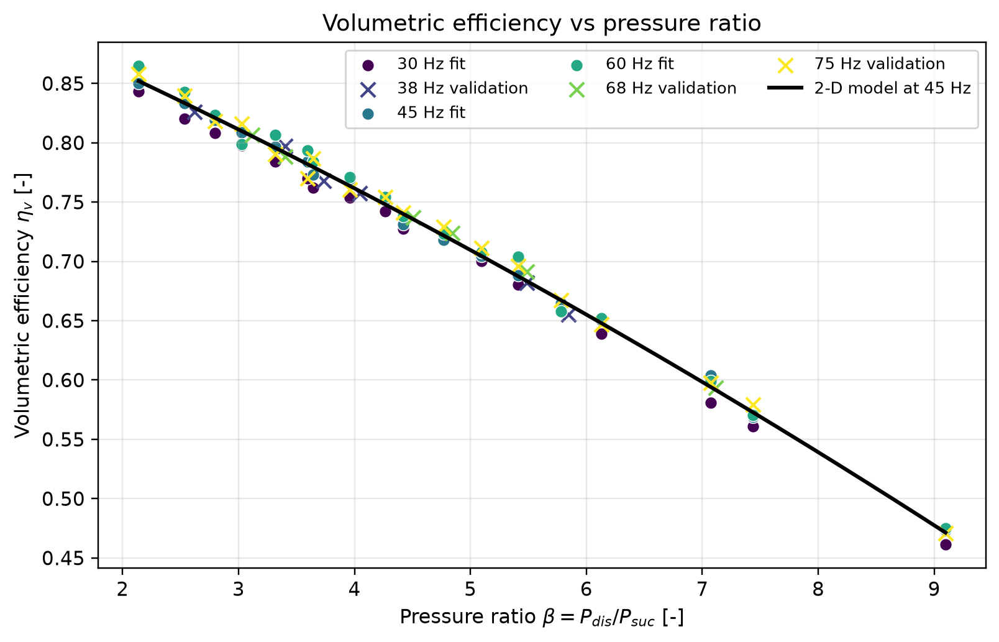
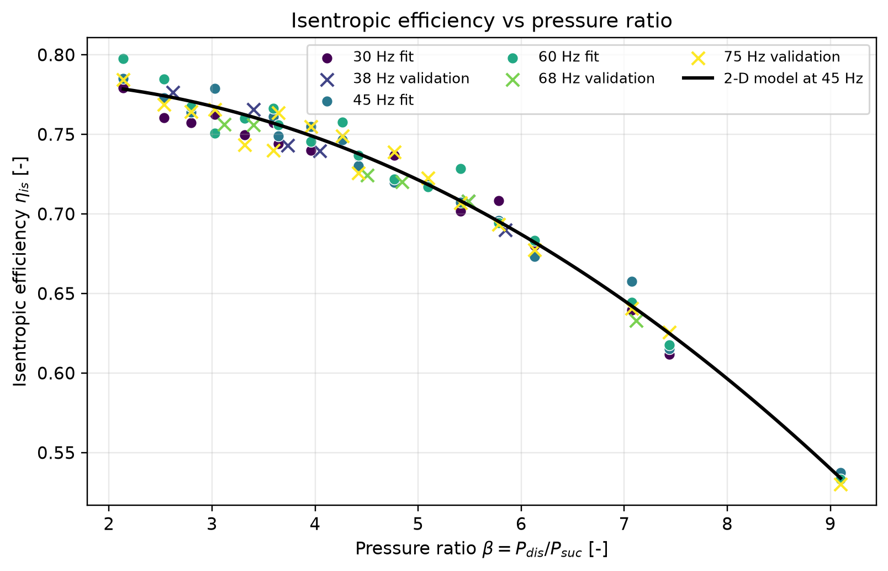
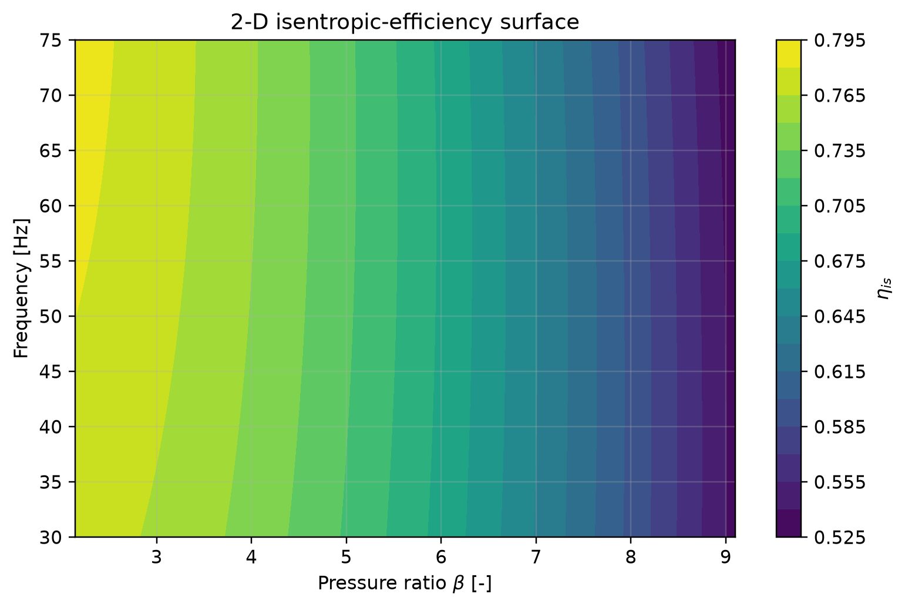
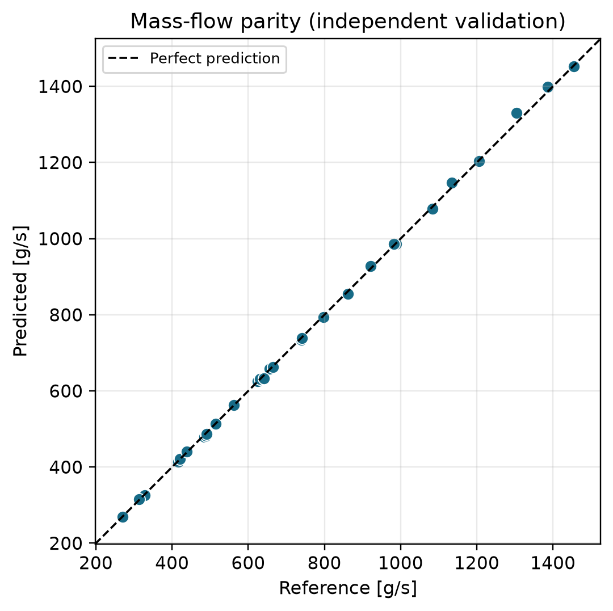
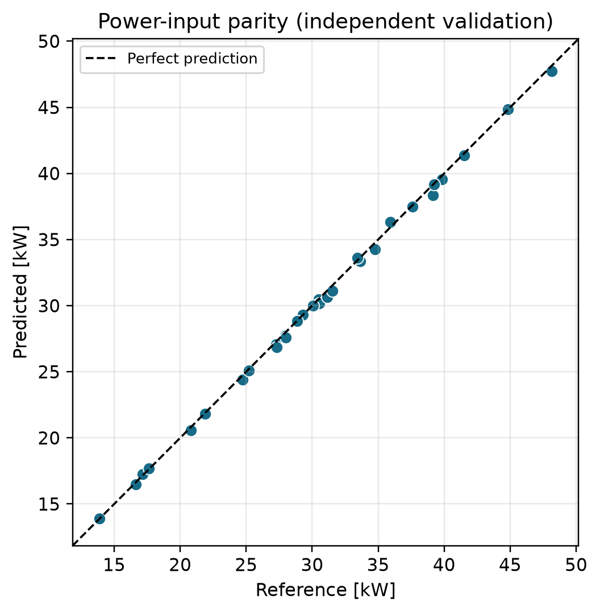
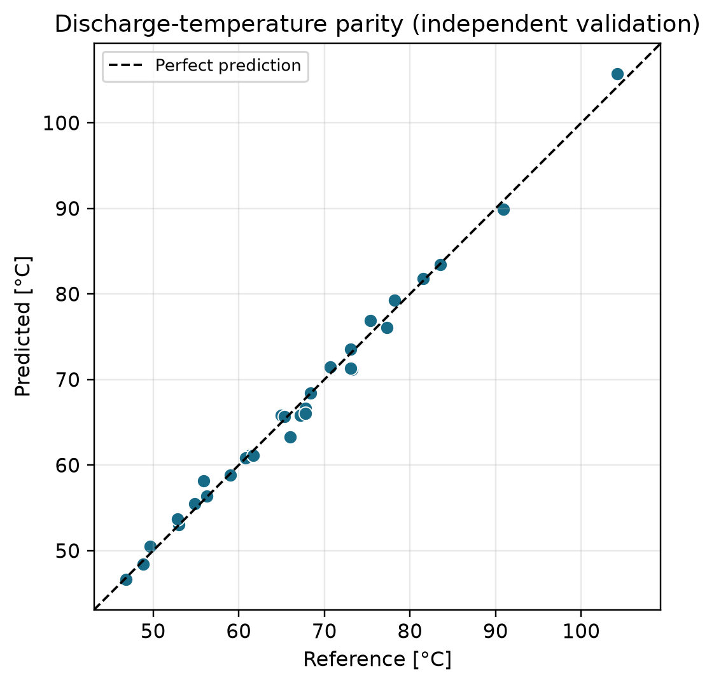

# ENME811 Advanced CAD/CAM Applications

## Compressor Modelling Project

**Auckland University of Technology**  
**Department of Mechanical Engineering**

| Item | Detail |
|---|---|
| Project | MATLAB modelling of a variable-speed hermetic reciprocating compressor |
| Refrigerant | R134a |
| Student name | ______________________________ |
| Student ID | ______________________________ |
| Submission date | October 2026 |

---

## Executive summary

A MATLAB model was developed for a variable-speed hermetic reciprocating compressor operating with R134a. The model follows the workflow required by the ENME811 brief: operating-point preparation, CoolProp refrigerant-property calculation, volumetric and isentropic efficiency evaluation, one-dimensional and two-dimensional polynomial regression, performance prediction and independent validation.

The client-supplied design duty is **50 kW cooling capacity with R134a at an evaporating temperature of −10 °C and 5 K suction superheat**. The selected reference compressor has a displacement of **1,147.6 cm³/rev**, sized so that the fitted model predicts **50.02 kW** at the design point (design condensing temperature 45 °C, 50 Hz). The model is evaluated over evaporating temperatures from −15 to 10 °C, condensing temperatures from 35 to 55 °C and frequencies from 30 to 75 Hz, with 5 K suction superheat. The performance table contains **84 operating points**: 54 fitting points and 30 independent validation points. Across the dataset, the pressure ratio ranges from **2.14 to 9.10**, volumetric efficiency from **0.462 to 0.865**, and isentropic efficiency from **0.530 to 0.797**.

The final two-dimensional correlations are

\[
\eta_v = 0.888934 -0.039473\beta -0.001200\beta^2 +0.093179 f_n -0.001939\beta f_n -0.033499 f_n^2
\]

\[
\eta_{is} = 0.752633 +0.009202\beta -0.003705\beta^2 +0.040816 f_n -0.003010\beta f_n -0.009658 f_n^2
\]

where \(\beta=P_{dis}/P_{suc}\) and \(f_n=f/50\). On the fitting data, the volumetric model gives \(R^2=0.9974\) and RMSE \(=0.00506\); the isentropic model gives \(R^2=0.9837\) and RMSE \(=0.00798\). On the 30 independent validation points, the model predicts mass flow with **0.60% MAPE**, electrical power with **0.76% MAPE**, and discharge temperature with **0.88 °C MAE**. These low errors reflect the smooth, well-sampled representative dataset and should not be interpreted as guaranteed accuracy for a physical compressor without measured manufacturer or laboratory data.

---

## 1. Introduction, objectives and scope

The compressor determines the refrigerant mass flow, pressure lift and most of the electrical power demand in a vapour-compression system. For a variable-speed hermetic reciprocating compressor, performance cannot be represented adequately by one fixed-speed curve because speed changes both the displacement rate and the loss mechanisms. A compact polynomial model is therefore useful for design studies, control development and system-level simulation.

The objectives of this project are to:

1. select and justify a compressor operating envelope;
2. organise performance data into fitting and independent validation sets;
3. calculate suction density, enthalpies, pressure ratio, volumetric efficiency and isentropic efficiency using CoolProp;
4. fit fixed-frequency one-dimensional efficiency correlations;
5. fit two-dimensional efficiency surfaces in pressure ratio and normalised frequency;
6. predict mass flow rate, power input and discharge temperature; and
7. quantify prediction errors using MAPE, RMSE and maximum absolute percentage error.

The scope is a steady-state compressor model. Pressure drops in suction/discharge lines, transient motor/inverter behaviour, oil circulation, shell heat loss detail and evaporator/condenser dynamics are outside the compressor sub-model.

---

## 2. Operating conditions, compressor selection and data sources

### 2.1 Adopted operating conditions

The operating conditions for this study were supplied for the commission: refrigerant R134a, a design cooling capacity of 50 kW, evaporating temperature −10 °C and suction superheat 5 K. The condensing temperature was not specified, so a design condensing temperature of 45 °C was adopted (a representative design value for air-cooled commercial refrigeration), and the modelling envelope spans 35–55 °C so that the sensitivity to condensing temperature is explicit. If a lecturer-issued condensing condition is provided later, the same MATLAB package can be rerun with that value.

| Variable | Adopted range or value |
|---|---:|
| Refrigerant | R134a (supplied) |
| Design cooling capacity | 50 kW (supplied) |
| Design evaporating temperature | −10 °C (supplied) |
| Suction superheat | 5 K (supplied) |
| Design condensing temperature | 45 °C (adopted design value) |
| Evaporating-temperature envelope | −15, −10, −5, 0, 5, 10 °C |
| Condensing-temperature envelope | 35, 45, 55 °C |
| Fitting frequencies | 30, 45, 60 Hz |
| Independent validation frequencies | 75 Hz, plus off-grid 38 and 68 Hz cases |
| Rated (design) frequency | 50 Hz |
| Suction pressure range | 1.639–4.146 bar |
| Discharge pressure range | 8.870–14.915 bar |
| Pressure-ratio range | 2.139–9.098 |

### 2.2 Selected reference compressor

| Parameter | Selected value |
|---|---:|
| Compressor type | Hermetic reciprocating, variable speed |
| Reference designation used in this study | VS-HR-1150 |
| Refrigerant compatibility | R134a |
| Bore × stroke × cylinders | 70 mm × 49.7 mm × 6 |
| Displacement volume | \(V_d=z(\pi/4)d^2s=1{,}147.6\ \text{cm}^3/\text{rev}\) |
| Swept-volume rate at 50 Hz | 206.6 m³/h |
| Speed range represented | 1,800–4,500 rpm |
| Frequency range represented | 30–75 Hz |

The displacement was sized from the supplied duty. At the design point (\(T_{evap}=-10\,^{\circ}\mathrm{C}\), \(T_{cond}=45\,^{\circ}\mathrm{C}\), 5 K superheat, 50 Hz), CoolProp gives a refrigerating effect of 132.98 kJ/kg, so a 50 kW duty requires a mass flow of 0.376 kg/s. With the modelled volumetric efficiency at the design pressure ratio (\(\beta=5.78\)), the required displacement is approximately 1,148 cm³/rev, realised here as a six-cylinder 70 mm × 49.7 mm geometry. The selected envelope covers commercial refrigeration duty at the supplied evaporating temperature while keeping the pressure ratio below approximately 9.1. R134a is retained because it is the supplied refrigerant and has a well-validated CoolProp equation of state.

### 2.3 Data source and provenance

The performance table contains mass flow rate, electrical power input and discharge temperature for every operating point. Because no manufacturer selection-software export was supplied, the table is a documented **representative manufacturer-style performance dataset**. Refrigerant properties were generated with CoolProp, and performance values were produced from physically realistic efficiency maps with small scatter. The dataset-generation script is included in the submission (`data/generate_dataset.py`) so that the provenance is auditable.

This distinction is important: the MATLAB framework is suitable for a named commercial compressor, but the numerical results in this report describe the adopted reference case. Replacing `compressor_performance_data.csv` with a genuine manufacturer export in the same format would model that product without changing the analysis code.

### 2.4 Fitting and validation split

The dataset contains 84 rows:

- **54 fitting points:** six evaporating temperatures × three condensing temperatures × three frequencies (30, 45, 60 Hz).
- **30 validation points:** the same 18 temperature combinations at the unseen 75 Hz frequency, plus 12 off-grid temperature/frequency combinations.

Validation rows are flagged in the CSV and are excluded from all regression coefficient calculations.

---

## 3. Literature review and modelling assumptions

Polynomial compressor maps are widely used in refrigeration-system simulation because they are compact, fast to evaluate and easy to embed in larger system models. The assignment's key reference, Wang and Lu (2025), follows this streamlined regression approach for speed-driven hermetic reciprocating compressors. In the present implementation, the polynomial inputs are the pressure ratio and normalised frequency; the outputs are volumetric and isentropic efficiency. This is preferable to fitting mass flow and power directly because the efficiency definitions retain the thermodynamic state calculation and make extrapolation behaviour easier to inspect.

The principal assumptions are:

1. steady-state operation at each tabulated point;
2. suction pressure equal to the saturation pressure at the evaporating temperature;
3. discharge pressure equal to the saturation pressure at the condensing temperature;
4. suction vapour superheated by 5 K (client-supplied);
5. negligible suction and discharge line pressure drops;
6. compressor speed \(N=60f\) rpm;
7. electrical power in the dataset represents total hermetic compressor input, so motor/inverter losses are included in the isentropic efficiency definition;
8. polynomial predictions are valid only inside, or very close to, the fitted pressure-ratio/frequency envelope.

---

## 4. Thermodynamic property and efficiency calculations

For each operating point, CoolProp provides the saturation pressures

\[
P_{suc}=P_{sat}(T_{evap}), \qquad P_{dis}=P_{sat}(T_{cond})
\]

and the suction state at \((P_{suc},T_{evap}+5\,\text{K})\). The calculated properties include suction density \(\rho_{suc}\), specific volume \(v_{suc}=1/\rho_{suc}\), suction enthalpy \(h_1\), suction entropy \(s_1\), and isentropic discharge enthalpy \(h_{2s}=h(P_{dis},s_1)\).

The pressure ratio is

\[
\beta=\frac{P_{dis}}{P_{suc}}.
\]

The displacement rate is

\[
\dot V_d = V_d f,
\]

with \(f\) in revolutions per second. Volumetric efficiency is

\[
\eta_v=\frac{\dot m v_{suc}}{\dot V_d}.
\]

Isentropic efficiency is

\[
\eta_{is}=\frac{\dot m(h_{2s}-h_1)}{W_{el}}.
\]

For prediction, the fitted efficiencies are used in the inverse relations

\[
\dot m_{pred}=\frac{\eta_{v,pred}\dot V_d}{v_{suc}},\qquad
W_{pred}=\frac{\dot m_{pred}(h_{2s}-h_1)}{\eta_{is,pred}}.
\]

The predicted discharge enthalpy and temperature are

\[
h_{2,pred}=h_1+\frac{h_{2s}-h_1}{\eta_{is,pred}},\qquad
T_{dis,pred}=T(P_{dis},h_{2,pred}).
\]

Across all 84 points, suction density ranges from 8.09 to 19.69 kg/m³, \(h_1\) from 393.80 to 409.01 kJ/kg, and \(h_{2s}\) from 425.22 to 441.23 kJ/kg. Reference mass flow ranges from 0.129 to 1.454 kg/s, electrical power from 9.73 to 48.13 kW, and discharge temperature from 46.6 to 104.3 °C.

---

## 5. Data preparation and operating-point selection

The CSV structure supplied to MATLAB is:

| Field | Meaning |
|---|---|
| `point_id` | Unique operating-point number |
| `dataset` | `Fitting` or `Validation` |
| `T_evap_C`, `T_cond_C` | Evaporating and condensing temperatures |
| `freq_Hz`, `speed_rpm` | Compressor frequency and shaft speed |
| `P_suc_bar`, `P_dis_bar` | Saturation pressures |
| `m_dot_kg_s` | Reference refrigerant mass flow rate |
| `W_el_kW` | Reference electrical power input |
| `T_dis_C` | Reference discharge temperature |
| `data_source` | Dataset provenance note |

The loader checks required columns and missing values. The calculated-variable workbook/CSV adds pressure ratio, suction density and specific volume, enthalpies, calculated efficiencies, model-predicted efficiencies, predicted mass flow, power and discharge temperature, and percentage errors.

---

## 6. Polynomial regression results

### 6.1 One-dimensional fixed-frequency fits

At each fitting frequency, quadratic correlations of the form \(\eta=c_0+c_1\beta+c_2\beta^2\) were fitted.

| Frequency | \(\eta_v\) coefficients \((c_0,c_1,c_2)\) | \(R^2\) | RMSE | \(\eta_{is}\) coefficients \((c_0,c_1,c_2)\) | \(R^2\) | RMSE |
|---:|---|---:|---:|---|---:|---:|
| 30 Hz | 0.926899, −0.037851, −0.001484 | 0.9989 | 0.00318 | 0.758713, 0.013722, −0.004288 | 0.9867 | 0.00707 |
| 45 Hz | 0.944234, −0.041150, −0.001156 | 0.9981 | 0.00420 | 0.793493, 0.001499, −0.003251 | 0.9875 | 0.00695 |
| 60 Hz | 0.959819, −0.044652, −0.000959 | 0.9954 | 0.00676 | 0.790687, 0.004258, −0.003576 | 0.9793 | 0.00920 |

The one-dimensional curves are useful for fixed-speed interpretation, but separate curves do not provide a single model for inverter operation. The two-dimensional model is therefore used for prediction.

### 6.2 Candidate two-dimensional models

Three candidate forms were compared using fitting points only:

| Model | Terms | \(\eta_v\) \(R^2\) | \(\eta_v\) RMSE | \(\eta_{is}\) \(R^2\) | \(\eta_{is}\) RMSE |
|---|---|---:|---:|---:|---:|
| A | \(1,\beta,\beta^2\) | 0.9936 | 0.00789 | 0.9819 | 0.00842 |
| B | \(1,\beta,\beta^2,f_n,f_n^2\) | 0.9973 | 0.00513 | 0.9833 | 0.00809 |
| C | \(1,\beta,\beta^2,f_n,\beta f_n,f_n^2\) | **0.9974** | **0.00506** | **0.9837** | **0.00798** |

Adding frequency reduces the volumetric-efficiency RMSE from 0.00789 to approximately 0.0051. The interaction model C gives the lowest RMSE for both responses and is retained. The improvement for isentropic efficiency is smaller, indicating that pressure ratio is the dominant variable for that response in the adopted dataset.

### 6.3 Final two-dimensional correlations

With \(f_n=f/50\):

\[
\boxed{\eta_v = 0.888934 -0.039473\beta -0.001200\beta^2 +0.093179 f_n -0.001939\beta f_n -0.033499 f_n^2}
\]

\[
\boxed{\eta_{is} = 0.752633 +0.009202\beta -0.003705\beta^2 +0.040816 f_n -0.003010\beta f_n -0.009658 f_n^2}
\]

| Response | \(R^2\) | Adjusted \(R^2\) | RMSE |
|---|---:|---:|---:|
| \(\eta_v\) | 0.9974 | 0.9971 | 0.00506 |
| \(\eta_{is}\) | 0.9837 | 0.9820 | 0.00798 |

The negative \(\beta\) and \(\beta^2\) contributions produce the expected decline in efficiency as pressure ratio increases. The frequency terms are comparatively small but measurable; the interaction terms allow the pressure-ratio slope to vary slightly with speed.

---

## 7. MATLAB model structure and implementation

The MATLAB package is organised around one master script and six functions:

| File | Role |
|---|---|
| `main_compressor_model.m` | Runs the complete workflow and writes result tables |
| `loadCompressorData.m` | Imports the CSV and checks data quality |
| `getRefrigerantProp.m` | Calls CoolProp through MATLAB's Python interface |
| `calcEfficiencies.m` | Calculates properties, \(\beta\), \(\eta_v\) and \(\eta_{is}\) |
| `fitEfficiencyModels.m` | Fits 1-D and 2-D polynomial models using fitting rows only |
| `predictPerformance.m` | Predicts \(\dot m\), \(W_{el}\), \(T_{dis}\), efficiencies and \(\beta\) |
| `validateModel.m` | Performs independent validation and creates figures |

The master script saves calculated variables, regression coefficients, candidate-model comparisons, one-dimensional fit tables, new-case predictions and validation results as CSV files. All inputs and outputs are labelled with units in the code and output tables.

---

## 8. Simulation results, validation and error analysis

### 8.1 Efficiency behaviour

Volumetric efficiency decreases strongly with pressure ratio, from approximately 0.86 at \(\beta\approx2.14\) to 0.46 at \(\beta\approx9.10\). This is consistent with clearance-volume re-expansion and valve/leakage losses becoming more important as pressure lift increases.

Isentropic efficiency also declines with pressure ratio, from approximately 0.80 to 0.53. The frequency spread is visible but smaller than the pressure-ratio effect.

The fitted surface confirms that pressure ratio is the dominant axis. Frequency modifies the surface modestly, which is why the full speed-dependent model improves the fit without changing the overall physical trend.

### 8.2 Design-point performance (supplied duty)

The fitted model was evaluated at the client-supplied design duty. Cooling capacity is \(\dot Q=\dot m\,(h_1-h_f(T_{cond}))\), where \(h_f(T_{cond})\) is the saturated-liquid enthalpy at the condensing temperature (no subcooling was specified).

| Quantity | Value |
|---|---:|
| Evaporating temperature | −10 °C |
| Design condensing temperature | 45 °C |
| Suction superheat | 5 K |
| Rated frequency | 50 Hz |
| Suction / discharge pressure | 2.006 / 11.599 bar |
| Pressure ratio \(\beta\) | 5.782 |
| Suction density | 9.80 kg/m³ |
| Refrigerating effect \(h_1-h_f\) | 132.98 kJ/kg |
| Required mass flow for 50 kW | 0.3760 kg/s |
| Predicted \(\eta_v\) / \(\eta_{is}\) | 0.669 / 0.696 |
| Predicted mass flow | 0.3762 kg/s |
| Predicted electrical power | 20.33 kW |
| Predicted discharge temperature | 71.4 °C |
| **Predicted cooling capacity** | **50.02 kW** |
| Cooling COP | 2.46 |

The selected displacement therefore meets the 50 kW duty at the design point with a predicted input of approximately 20.3 kW (cooling COP 2.46). Capacity at other condensing temperatures and speeds follows directly from the validated model: raising the condensing temperature increases \(\beta\), reduces both efficiencies, and lowers capacity while increasing power.

### 8.3 Predictions at representative operating points

The following points were not used as fitting rows in the regression coefficient calculation and illustrate model use at new conditions:

| \(T_{evap}\) (°C) | \(T_{cond}\) (°C) | \(f\) (Hz) | \(\beta\) | \(\eta_v\) | \(\eta_{is}\) | \(\dot m\) (g/s) | \(W_{el}\) (kW) | \(T_{dis}\) (°C) |
|---:|---:|---:|---:|---:|---:|---:|---:|---:|
| −12 | 40 | 38 | 5.488 | 0.680 | 0.704 | 269.2 | 13.92 | 65.8 |
| −2 | 50 | 68 | 4.842 | 0.722 | 0.728 | 738.5 | 34.25 | 71.4 |
| 7 | 45 | 52 | 3.096 | 0.810 | 0.768 | 862.1 | 27.10 | 60.1 |
| 3 | 55 | 75 | 4.575 | 0.734 | 0.736 | 985.8 | 43.54 | 74.8 |

The table shows the expected trends: higher evaporating temperature and frequency increase mass flow; higher condensing temperature increases pressure ratio and power demand; discharge temperature rises with pressure lift and power input.

### 8.4 Independent validation

The final model was applied to all 30 validation points without refitting.

| Quantity | MAPE | RMSE | Maximum error |
|---|---:|---:|---:|
| Mass flow rate | **0.60%** | 0.00715 kg/s | 2.03% APE |
| Electrical power | **0.76%** | 0.298 kW | 1.96% APE |
| Discharge temperature | 0.88 °C MAE | 1.13 °C RMSE | 2.68 °C maximum AE |

The parity plots lie close to the perfect-prediction line across the validation range. No strong proportional bias is visible. The largest mass-flow percentage error is approximately 2.03%, and the largest power error is approximately 1.96%.

---

## 9. Discussion

The model satisfies the assignment workflow in a transparent way. Its main strength is separation of thermodynamics from regression: CoolProp determines the state properties, while the polynomial only represents compressor efficiency behaviour. This makes the model easier to audit than a direct black-box fit to mass flow and power.

Pressure ratio is the dominant physical variable. The near-linear decline in volumetric efficiency is consistent with clearance re-expansion in a reciprocating machine. The isentropic-efficiency decline reflects increased valve pressure drop, leakage, heat-transfer irreversibility and motor/inverter losses at higher lift. Frequency has a smaller effect on efficiency but a direct and large effect on mass flow through the displacement-rate term.

The candidate-model comparison shows that adding frequency terms materially improves volumetric-efficiency prediction, while the interaction term provides a modest further improvement. For isentropic efficiency, the pressure-ratio-only model is already strong, so additional frequency terms should be retained only because the assignment requires a two-dimensional speed-dependent model and because adjusted \(R^2\) remains favourable.

The principal limitation is data provenance. The performance table is representative rather than a measured map for a named commercial compressor. Consequently, the very low validation errors demonstrate internal consistency of the modelling chain on smooth data, not expected field accuracy. Real manufacturer data may contain rating-standard differences, rounding, interpolation artefacts and operating regions where a quadratic surface is inadequate. Before using the model for equipment selection, the CSV should be replaced with manufacturer software output or laboratory measurements and the regression repeated.

A second limitation is extrapolation. The model should not be used materially beyond \(\beta=2.14\)–9.10 or 30–75 Hz without additional data. At higher pressure ratios, discharge temperature and valve stress may become limiting before polynomial error becomes apparent.

Recommended improvements are:

1. import genuine manufacturer selection-software data for a named compressor;
2. include measured suction/discharge pressures rather than inferring both from saturation temperatures;
3. test alternative basis functions or physics-guided clearance-volume models;
4. include uncertainty intervals for predictions; and
5. couple the compressor map to evaporator, condenser and expansion-device models for full system simulation.

---

## 10. Conclusions

1. A complete MATLAB compressor-modelling package was developed for a variable-speed hermetic reciprocating compressor using R134a.
2. The compressor was sized for the supplied duty: the selected displacement is 1,147.6 cm³/rev, the operating envelope covers pressure ratios from 2.14 to 9.10, and the fitted model predicts 50.02 kW of cooling at the design point (−10 °C evaporating, 45 °C condensing, 5 K superheat, 50 Hz) with 20.33 kW input (cooling COP 2.46).
3. Calculated volumetric efficiencies range from 0.462 to 0.865; isentropic efficiencies range from 0.530 to 0.797.
4. Fixed-frequency quadratic fits achieve \(R^2\) values of 0.9954–0.9989 for volumetric efficiency and 0.9793–0.9875 for isentropic efficiency.
5. The final two-dimensional models achieve \(R^2=0.9974\) for \(\eta_v\) and \(R^2=0.9837\) for \(\eta_{is}\) on fitting data.
6. On 30 independent validation points, mass-flow MAPE is 0.60%, power MAPE is 0.76%, and discharge-temperature MAE is 0.88 °C.
7. The package is data-agnostic: a genuine manufacturer export can replace the representative CSV without code changes.

---

## References

1. Wang, J. and Lu, W. “A Streamlined Polynomial Regression-Based Modeling of Speed-Driven Hermetic-Reciprocating Compressors.” *Applied Sciences*, 2025, 15(22), 12016.
2. Bell, I. H., Wronski, J., Quoilin, S., and Lemort, V. “Pure and Pseudo-pure Fluid Thermophysical Property Evaluation and the Open-Source Thermophysical Property Library CoolProp.” *Industrial & Engineering Chemistry Research*, 2014, 53(6), 2498–2508.
3. ASHRAE. *ASHRAE Handbook—Refrigeration*. American Society of Heating, Refrigerating and Air-Conditioning Engineers.
4. Secop. *BD50F Direct Current Compressor: R134a/R1234yf Technical Literature*. Public manufacturer literature used only as background for variable-speed hermetic compressor practice.
5. CoolProp documentation. Thermophysical property library and fluid property equations. http://www.coolprop.org/

---

## Appendix A — MATLAB package outputs

Running `main_compressor_model.m` produces:

- `calculated_variables.csv`
- `regression_coefficients.csv`
- `candidate_model_comparison.csv`
- `one_dimensional_fits.csv`
- `new_case_predictions.csv`
- `validation_results.csv`
- `figures/eta_v_vs_beta.png`
- `figures/eta_is_vs_beta.png`
- `figures/parity_mass_flow.png`
- `figures/parity_power.png`
- `figures/parity_discharge_temperature.png`

## Appendix B — Sample calculated operating points

| Point | Dataset | \(T_{evap}\) (°C) | \(T_{cond}\) (°C) | \(f\) (Hz) | \(\beta\) | \(\eta_v\) | \(\eta_{is}\) | \(\dot m\) (kg/s) | \(W\) (kW) | \(T_{dis}\) (°C) |
|---:|---|---:|---:|---:|---:|---:|---:|---:|---:|---:|
| 1 | Fitting | −15 | 35 | 30 | 5.41 | 0.681 | 0.702 | 0.18954 | 9.734 | 60.4 |
| 3 | Fitting | −15 | 35 | 60 | 5.41 | 0.704 | 0.729 | 0.39209 | 19.398 | 58.9 |
| 28 | Fitting | 0 | 35 | 30 | 3.03 | 0.798 | 0.762 | 0.38644 | 11.987 | 49.9 |
| 54 | Fitting | 10 | 55 | 60 | 3.60 | 0.794 | 0.766 | 1.07613 | 38.327 | 70.9 |
| 55 | Validation | −15 | 35 | 75 | 5.41 | 0.696 | 0.707 | 0.48469 | 24.717 | 61.3 |
| 84 | Validation | 8 | 50 | 38 | 3.40 | 0.797 | 0.766 | 0.64125 | 21.879 | 67.8 |

*Sample values are rounded from `calculated_variables.csv`; the CSV is the authoritative numerical record.*
